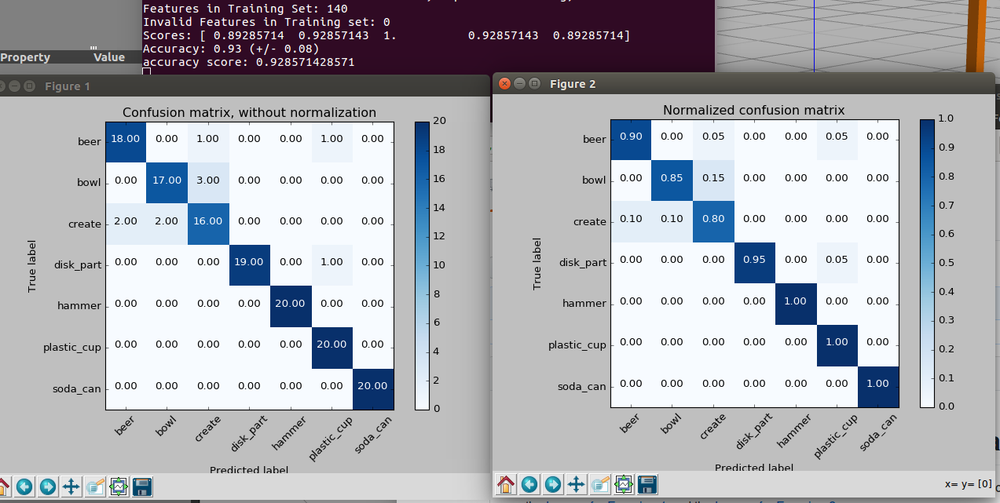
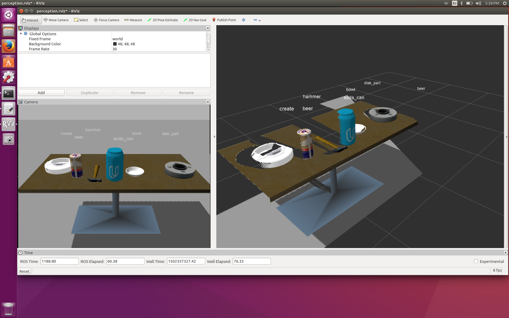

# point-cloud-recognition

- This project captures features of objects and then train a classifier to correctly identify the objects from a point cloud file.
- This is my solution for the [last perception exercise](https://github.com/udacity/RoboND-Perception-Exercises/tree/master/Exercise-3)
from [Udacity's RoboND](https://www.udacity.com/robotics).

- This builds upon my [solution for the second perception exercise](https://github.com/mithi/point-cloud-clusters)
where I use the DBSCAN algorithm to cluster points pertaining to the same object.




# Important Files
```
- - ./src/sensor_stick/scripts/capture_features.py
- - ./src/sensor_stick/src/sensor_stick/features.py
- - ./src/sensor_stick/scripts/train_svm.py
- - ./src/sensor_stick/scripts/object_recognition.py
- - ./src/sensor_stick/scripts/filtering_helper.py
```

# Dependencies
- You need an Ubuntu 16.04.2 with ROS full-desktop-version which includes RViz and Gazebo
- You must clone the repository, go inside the directory and install the dependencies:
```
$ rosdep install --from-paths src --ignore-src --rosdistro=kinetic -y
$ catkin_make
```
 - Add the following to your `.bashrc` file:
 ```
export GAZEBO_MODEL_PATH=~/catkin_ws/src/sensor_stick/models
source ~/catkin_ws/devel/setup.bash
```
- You also need SKLearn ans SciPy
```
pip install sklearn scipy
```

# How to Use

## Training a Model
- First you must capture features.
- Run this on one terminal. You should see an empty scene in Gazebo with only the sensor stick robot.
```
$ roslaunch sensor_stick training.launch
```
- On another terminal run this:
```
$ rosrun sensor_stick capture_features.py
```
- This script spawns each object in random orientations (default 20 orientations per object)
and computes features based on the point clouds resulting from each of the random orientations.
The features will now be captured and you can watch the objects being spawned in Gazebo.
It should take 5-10 seconds for each random orientations (depending on your machine's resources)
so with 7 objects total it takes awhile to complete. When it finishes running you should have a `training_set.sav` file.
- You can inspect the script here where you will see that `NUMBER_OF_SPAWNS = 20`
```
./src/sensor_stick/scripts/capture_features.py
```
- The features captured are the normalized histogram of the colors of the three channels in HSV format as well as the
normalized histogram of the normal vector at each point which capture the shape
- You can inspect how the features being retrieved from the point cloud here.
```
./src/sensor_stick/src/sensor_stick/features.py
```
- After this run the following:
```
$ rosrun sensor_stick train_svm.py
```
- This runs the following script:
```
./src/sensor_stick/scripts/train_svm.py
```
## Object recognition
- Run this command
```
$ roslaunch sensor_stick robot_spawn.launch
```
- Then run the following command inside `/src/sensor_stick/scripts/`
```
python object_recognition.py
```
- You can inspect the script here
```
./src/sensor_stick/scripts/object_recognition.py
```
- You may notice that it uses the file `model.sav` to detect the objects.
