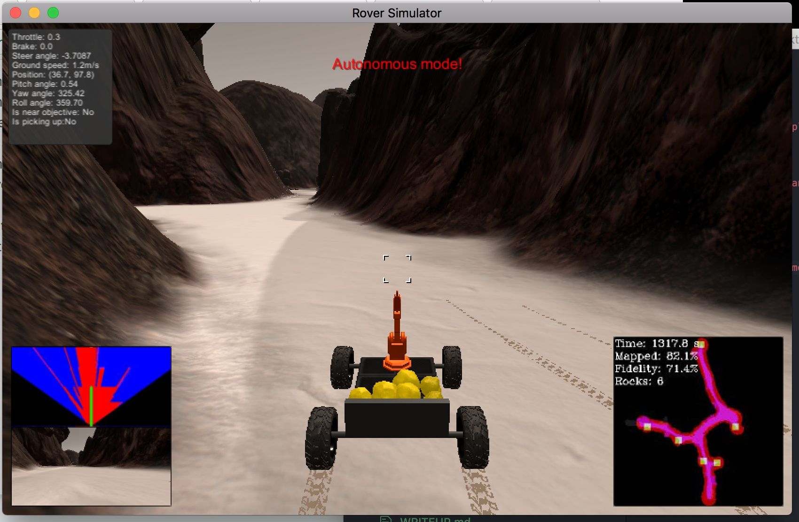
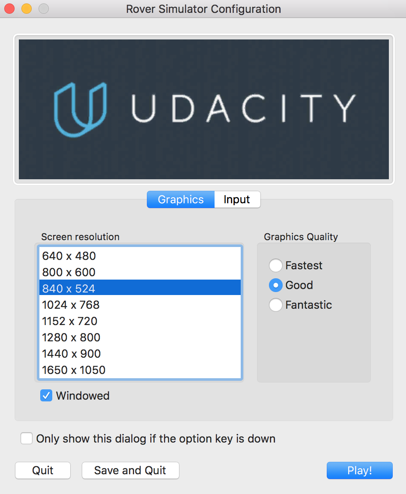
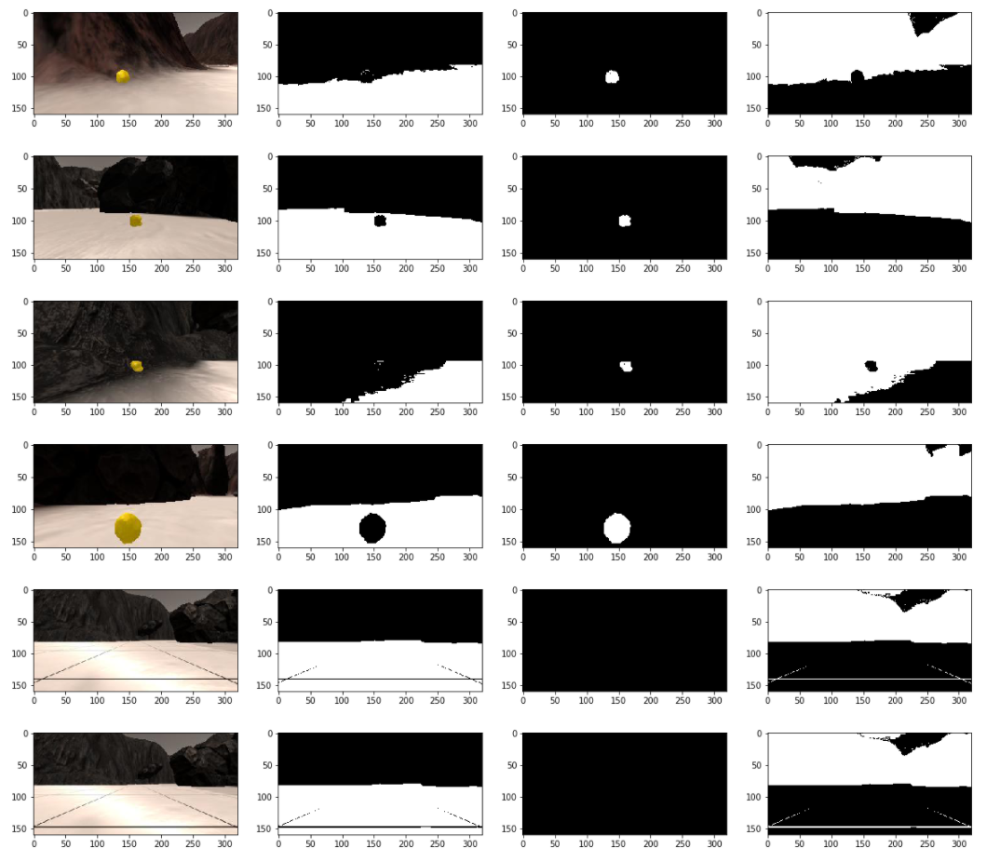
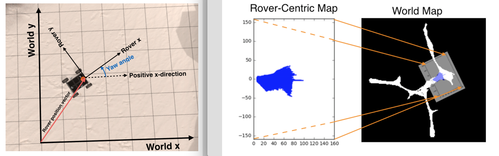
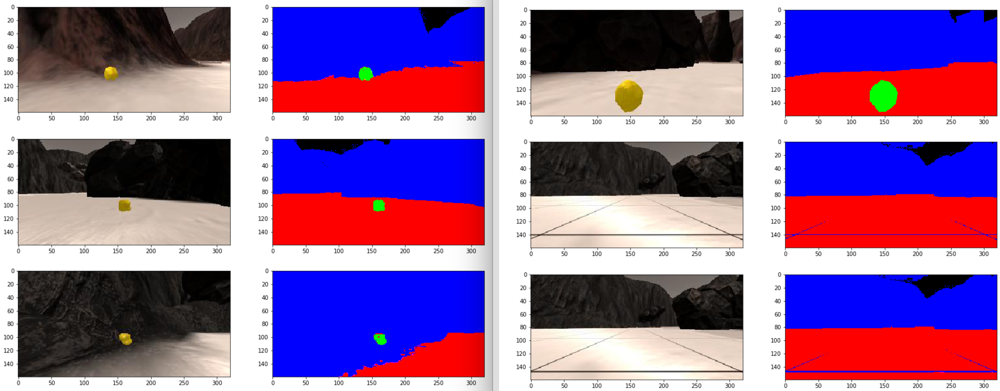
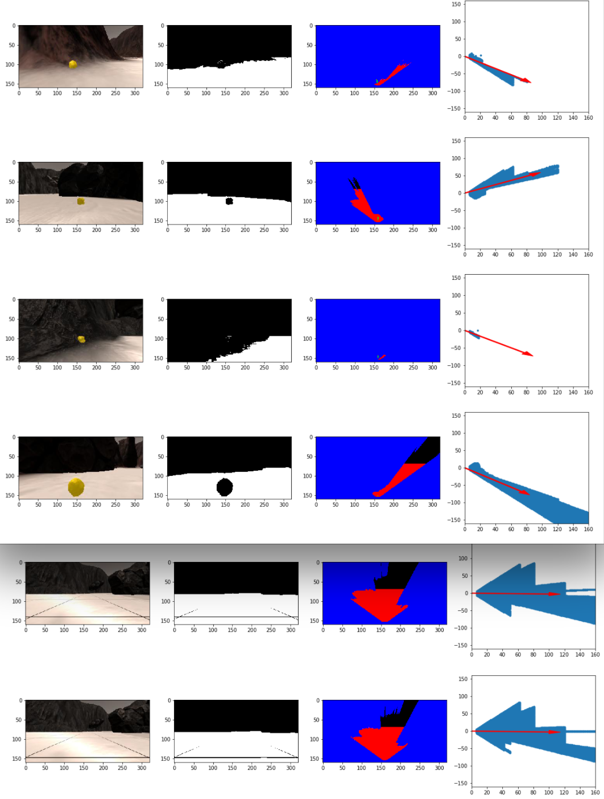
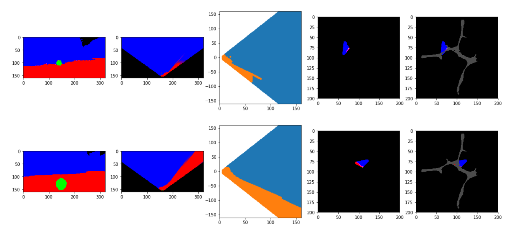

# Outline
- Summary
- Videos
- Data Analysis
- - Obstacle, Navigable Terrain, and Rock Sample Identification
- - World Map Creation
- Autonomous Navigation and Mapping
- - Perception
- - Decision-making
- Known Issues and Recommendations For Improvement



# Summary
- I have used image processing and computer vision techniques to do the following:
- - Identify rock samples, obstacles and navigable terrain.
- - Map more than 40% of the environment with atleast 60% fidelity to the ground truth
- I have used the results of the computer vision techniques make inferences about the environment;
- I have used the inferences to make a decition pipeline which proposes what actions to take in order to navigate the environment autonomously and pick up desired samples.
- - The rover has picked up 4 - 6 samples in signifcantly less than 20 minutes given my decision pipeline at most times I run this at the simulator

> I chose an 840 x 520 resolution with the graphic quality of 'good' for autonomous navigation



# Videos
- [Notebook Analysis Output Video](https://github.com/mithi/rover/blob/master/output/test_mapping.mp4)
- [Screen Recording (with latency, so rover wobbles)](https://youtu.be/abqHyHql_EY)
- [Recorded via iPhone (no lag)](https://youtu.be/GiGVlfZQzI0)


# Data Analysis
- [The notebook](https://github.com/mithi/rover/blob/master/code/rover_playround.ipynb)
- [Output video of this notebook](https://github.com/mithi/rover/blob/master/output/test_mapping.mp4)

## Obstacle, Navigable Terrain, and Rock Sample Identification
- Given a camera image from the rover, obstacles (`blocked`), samples (`rock`), and navigable terrain (`ground`) are identified via their color.
- I converted the image in BGR format to HLS format as yellows are easier to distinguish using this format.
- Obstacles are of dark brownish color which has a low lightness
- Samples are of yellowish color, which has a high lightness and low saturation
- Navigable terrain are of light brownish color which has high lightness, and to distinguish
from samples has a saturation above a certain threshold. They are located in the lower area of
the image.
- The minimum and maximum thresholds for identifying pixels of interest are calibrated manually. Given the images located in the `calibration_images` folder
- Ultimately I found these thresholds to work pretty well for HLS channels respectively.

```python
ground_thresh_min = (0, 100, 70)
ground_thresh_max = (255, 255, 255)

rock_thresh_min = (0, 100, 0)
rock_thresh_max = (255, 255, 70)

blocked_thresh_min = (0, 0, 0)
blocked_thresh_max = (255, 100, 255)
```
- I defined a function `filter_hls(img)` which can be found in `code cell #16`
- This is  a color thresholding function which identify pixels above and below given thresholds




## World Map Creation

- Algorithmically, I did the following steps for world map creation:
- Initally: I started a a map which is a blank image.
- Repeatedly: Each time there is an incoming image:
- - 1. Use the color thresholding function `filter_hls()` to identify the `rock`, `ground`, and `blocked` pixels
- - 2. Transform the perspective (using `transform_perspective()`) of these pixels from _camera view_ to _sky view_ using _Open CV's_ builtin `cv2.getPerspectiveTransform(src_points, dst_points)` and  `cv2.warpPerspective(img, transform_matrix, dimensions)` functions. `src_points` and `dst_points` are derived from the given calibration images located in the `calibration_images` folder.
- - 3. Convert these transformed (_warped_) pixel locations to rover coordinates using `get_rover_coordinates()` function
- - 4. Convert these pixel locations to coordinates in the `world_map` by rotating, scaling, and translating. The `convert_rover_to_world_coordinates()` is used
- - 5. Add these pixel location in `world coordinates` to the image map, giving `rock`, `ground`, and `blocked` pixels their own respective unique identifying color.



# Autonomous Navigation and Mapping

## Perception
- [perception.py](https://github.com/mithi/rover/blob/master/code/perception.py)
- Given a camera image from the rover my `perception_step()` function is roughly like this:

### 1.Identify pixel locations of each _object of interest_ in the Camera
- I got the `cam_pixels` pixels that identifying the `rock` samples, the `ground` navigable terrain, and the `blocked` obstacles using color thresholding




### 2. Derive perceived properties given pixel locations of each _object of interest_
- This includes the following:
- - The `warped pixels` locations by transforming the perspective from _camera view_ to _sky view_  of `cam_pixels`
- - The `mean pixel` location of all the pixels.
- The  `rover pixels` location by converting the `warped pixels` to the Rover coordinate space
- The `polar pixels` which is the `rover pixels` in coordinate space.
- - These `polar pixels` are used to compute the `mean angle` that can be used as the angle of steering of the rover   
- The `world pixels` transformed from the `rover pixels` in rover coordinate space to world map coordinate space
- The `size` which is the total number of pixels for each _object of interest_




### 3. Update Rover Properties, World Map, and Rover Vision Image
- The `warped pixels` locations are displayed as the robot's vision image, giving `rock`, `ground`, and `blocked` pixels their own respective unique identifying color.
- The `world pixels` locations are added to the image map, giving `rock`, `ground`, and `blocked` pixels their own respective unique identifying color.
- The `mean pixel` location of the `ground` or `rock` if it exist is used to draw a line from from the bottom center to give us a visual idea of the direction the rover should possibly be steering towards.
- If the `size` of `rock` is greater than a threshold then this means there is a perceived sample we should go to. Instead of using the `ground mean angle` as the suggested steering angle of the rover. Use the `rock mean angle` instead.
- Update `Rover.angle` and `Rover.found_rock` to `True`, appropriately as mentioned above
- Update `Rover.ground_pixel_count` given the `size` of `ground`




## Decision-making
- [decision.py](https://github.com/mithi/rover/blob/master/code/decision.py)
- Given the updated results of `perception_step()` function the `decision_step()` function is roughly like this:

### 1. Update last recorded position
- We are given the current x, y position, and heading of the rover, if this is significantly different from the last recorded position we can say that we've sufficiently moved.
- If we did, let's update the last recorded position, and note that there is sufficient movement

### 2. Check if we're stuck or near a sample
- If we're near a sample, we should stop moving so make `mode = stop`
- If we're not near a sample and our velocity is zero even though we are throttling, then this means we are `stuck`
- If we're not near a sample and there is no sufficient movement even though a significant time has passed, then we can safely say we are stuck.

### 3A. If we're in `forward` mode, command appropriately
- Check if the path is sufficiently clear given the `Rover.ground_pixels_count` and a threshold `Rover.is_blocked_thresh`
- If the path is clear, we should move forward given the suggested steering angle. We should accelerate if we haven't reached our allowed velocity.
- If the path is clear and we have found the rock, we should move slowly by keeping our acceleration to a minimum.
- If the path is blocked let's brake and and switch to `stop mode`

### 3B. If we're in `stop` mode, command appropriately
- If we're not yet completely stopped, keep braking.
- If we've completely stopped, check if path is sufficiently clear, given
the `Rover.ground_pixels_count` and a threshold `Rover.is_clear_path_thresh`
- If path is sufficiently clear, turn in place, else switch to `forward mode`

### 3C. If we're `stuck`, let's turn in place

### 4. Pick-up the sample if we could and haven't yet
- If we're not moving and we're near a sample, then let's pick it up

# Known Issues and Recommendations For Improvement
- There are some cases that the rover gets stuck but isn't detected by our pipeline, investigate these cases and check how to detect them
- There are some cases that the rover gets stuck but can't get `unstuck` using a simple turning method, try to make a new mode called `reverse` where it will move backward for a sufficient time before turning.
- The rover wanders around without considering if it has already traversed that path before. We can develop a smarter method by considering its previous traversed positions and avoid heading back there.
- The Rover moves slowly and conservatively. Try to make it move faster without running into problems
- Sometimes the rover loops around a large area several times before going to a new path, try to avoid getting into this scenario my considering its previous traversed positions and avoid heading back there.
- Try to improve the mapping by not considering camera images taken when the rover has sufficient pitch and roll. Having certain pitch and roll means the camera images isn't taken directly parallel to the ground. This breaks our assumptions and affects the fidelity when compared with the ground truth.
- The rover cannot go back to it's starting location when it has collected all rock sample. This feature is not implemented!
- There are many places in the code that can be refactored to be better written and more readable
