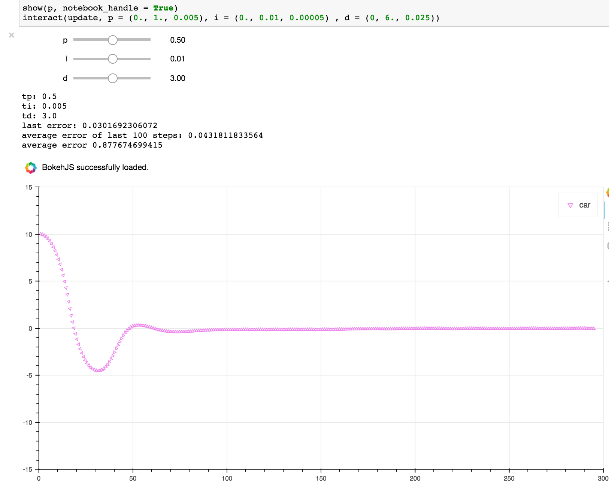
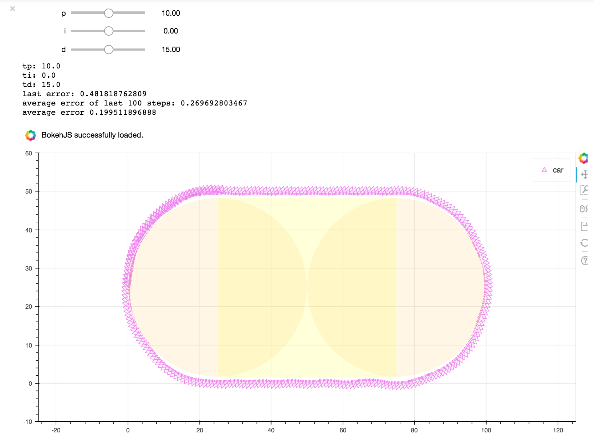

# PID Toys
1. My turn-in code for the PID control project of Udacity's Self-Driving Car Engineer Nanodegree Program.
## [See directory](./MANUAL-PID-PROJECT)
2. PID Notebooks
## [See directory](./notebooks)

# PID notebooks
A small collection of Jupyter notebooks demonstrating PID control concepts I learned from  Udacity's free A.I for robotics course. This includes parameter optimization (twiddle) and a few interactive visualization using Bokeh.

---
---
- [RaceTrack control assignment](https://www.youtube.com/watch?v=64PjCuGOHzQ)
- [RaceTrack control solution](https://www.youtube.com/watch?v=GCJXunrJjBY)
---
---

